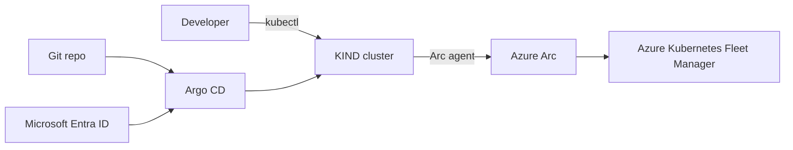

# AKS Everywhere Demo

This repo is a compact, end-to-end demo that Arc-enables a local KIND cluster and adds it as an Azure Kubernetes Fleet Manager member cluster. The demo highlights using the AKS extension for Argo CD (currently in preview) to deploy a lightweight llama-server for model inference.

The Argo CD instance is configured to use Microsoft Entra ID for authentication, leveraging workload identity federation on the Arc-enabled cluster.

## What you will create

- A local KIND cluster connected to Azure Arc with workload identity enabled.
- A Fleet hub with the KIND cluster as a member.
- Argo CD running via the AKS extension, using Entra ID SSO.
- A demo llama-server app deployed via GitOps.

## Conventions used here

- The cluster name is `kind` as used in the commands.
- Terraform runs from the `terraform/` directory and outputs environment variables used later.
- Files referenced by `kubectl apply -f ...` are in this repo; adjust paths only if you renamed folders.

## Architecture at a glance

Think of this as three lanes: local compute (KIND), Azure management (Arc + Fleet), and GitOps delivery (Argo CD). Entra ID is the glue that keeps access and identity consistent end-to-end.



## Prerequisites

You need a local Kubernetes cluster (KIND), a model runtime (llama.cpp), and Azure CLI. Docker is the container runtime that KIND relies on.

If you don't have Docker yet, grab it from [https://www.docker.com/get-started](https://www.docker.com/get-started).

> [!note]
> All commands are written for a POSIX-compliant shell. If you're on Windows, consider using WSL or Git Bash.

If you are working on macOS or Linux, you can use Homebrew to install the remaining dependencies:

Install llama-server

```bash
brew install llama.cpp
```

Install kind

```bash
brew install kind
```

## Azure setup

Start by logging into Azure and setting the subscription you want to use for the demo.

```bash
az login
```

Register the required resource providers for Azure Arc, Fleet, and the Argo CD extension.

```bash
az provider register --namespace Microsoft.Kubernetes
az provider register --namespace Microsoft.KubernetesConfiguration
az provider register --namespace Microsoft.ExtendedLocation
```

Install the necessary Azure CLI extensions for Arc, Fleet, and Kubernetes configuration.

```bash
az extension add --name aks-preview
az extension add --name connectedk8s
az extension add --name aksarc
az extension add --name customlocation
az extension add -n k8s-configuration
az extension add -n k8s-extension
```

To pre-provision the Azure resources needed for the demo, run the Terraform script in the `terraform/` directory.

```bash
cd terraform
```

Initialize Terraform and apply the configuration.

```bash
terraform init
```

Export the Azure subscription ID to an environment variable so Terraform can use it.

```bash
export ARM_SUBSCRIPTION_ID=$(az account show --query id -o tsv)
```

Apply the Terraform configuration and confirm the resources to be created when prompted.

```bash
terraform apply
```

Terraform sets up the Azure resources and identity pieces that you will need later. The outputs are captured into environment variables so you can keep copy-pasting without hunting for IDs.

```bash
read -r RG_NAME TENANT_ID SSO_CLIENT_ID ADMIN_GROUP_OBJECT_ID WI_CLIENT_ID FLEET_NAME <<< "$(
  terraform output -json | jq -r '[
    .rg_name.value,
    .argocd_app_tenant_id.value,
    .argocd_app_client_id.value,
    .admin_group_object_id.value,
    .managed_identity_client_id.value,
    .fleet_name.value
  ] | @tsv'
)"
```

Navigate back to the root of the repo to continue with the Arc and Argo CD setup.

```bash
cd ..
```

## Arc-enable KIND cluster

Here you create a local cluster and onboard it to Azure Arc. Arc turns your local cluster into a first-class Azure resource, which is required for Fleet membership and for deploying the Argo CD extension.

```bash
kind create cluster
```

Let's connect the cluster to Azure Arc. The `az connectedk8s connect` command is used to onboard the cluster, and the `--enable-oidc-issuer` and `--enable-workload-identity` flags set up the necessary OIDC issuer for workload identity federation.

```bash
az connectedk8s connect \
--name kind \
--resource-group $RG_NAME \
--enable-oidc-issuer \
--enable-workload-identity
```

The onboarding process can take several minutes to complete. Once it's done, you can retrieve the cluster ID and OIDC issuer URL, which are needed for the next steps.

```bash
read -r CLUSTER_ID OIDC_ISSUER <<< "$(az connectedk8s show -n kind -g $RG_NAME --query '[id,oidcIssuerProfile.issuerUrl]' -o tsv)"
```

Add the newly connected cluster as a member of the Fleet hub. This allows you to manage it alongside other clusters and deploy applications to it via Fleet.

```bash
az fleet member create \
--fleet-name $FLEET_NAME \
--resource-group $RG_NAME \
--name kind \
--member-cluster-id $CLUSTER_ID
```

Grant yourself admin permissions on the Fleet Hub cluster so you can access the kube-apiserver later. The role assignment gives you the "Azure Arc Kubernetes Cluster Admin" role at the scope of the cluster resource in Azure, which translates to admin permissions on the cluster itself.

```bash
az role assignment create \
--assignee $(az ad signed-in-user show --query id -o tsv) \
--role "Azure Arc Kubernetes Cluster Admin" \
--scope $CLUSTER_ID
```

## ArgoCD with Entra ID

Install the Argo CD extension and wire it up to Microsoft Entra ID for SSO via workload identity. The goal is to avoid local admin passwords and use federated identity that lines up with Azure RBAC and group membership.

The Argo CD OIDC enablement is documented [here](https://argo-cd.readthedocs.io/en/stable/operator-manual/user-management/microsoft/#configure-argo-to-use-the-new-entra-id-app-registration). The key pieces are the OIDC config which will be stored in the `argocd-cm` ConfigMap and the RBAC policy which will be stored in the `argocd-rbac-cm` ConfigMap.

Create the OIDC configuration in a variable to keep everything self-contained.

```bash
read -r -d '' OIDC_CONFIG <<EOF
name: Microsoft Entra ID
issuer: https://login.microsoftonline.com/$TENANT_ID/v2.0
clientID: $SSO_CLIENT_ID
azure:
  useWorkloadIdentity: true
requestedIDTokenClaims:
  groups:
    essential: true
requestedScopes:
  - openid
  - profile
  - email
EOF
```

Next, create the RBAC policy that maps Entra ID groups to Argo CD built-in admin role. This is a simple mapping that says anyone in the specified Azure AD group gets admin permissions in Argo CD.

```bash
read -r -d '' POLICY_CSV <<EOF
g, "$ADMIN_GROUP_OBJECT_ID", role:admin
EOF
```

Now you can create the Argo CD extension on the cluster. The `az k8s-extension create` command is used to install the extension, and the `--config` flags are used to pass in the OIDC configuration and RBAC policy as ConfigMap entries. The extension uses a managed identity and Entra ID client, and a federated credential lets the Argo CD server service account request tokens.

```bash
az k8s-extension create \
--resource-group $RG_NAME \
--cluster-name "kind" \
--cluster-type "connectedClusters" \
--name "argocd" \
--extension-type "Microsoft.ArgoCD" \
--release-train "preview" \
--auto-upgrade-minor-version \
--config "redis-ha.enabled=false" \
--config "global.domain=localhost:9000" \
--config "azure.workloadIdentity.enabled=true" \
--config "azure.workloadIdentity.clientId=$MANAGED_IDENTITY_CLIENT_ID" \
--config "azure.workloadIdentity.entraSSOClientId=$SSO_CLIENT_ID" \
--config "configs.cm.oidc\.config=$(printf '%s' "$OIDC_CONFIG")" \
--config "configs.rbac.policy\.csv=$(printf '%s' "$POLICY_CSV")" \
--config "configs.cm.admin\.enabled=false"
```

The extension installation can take several minutes. Once it's done, you should have Argo CD running in the `argocd` namespace on the KIND cluster, and it should be configured to use Microsoft Entra ID for authentication.

> [!important]
> The extension leverages the open-source Helm chart maintained by the Argo CD community, but includes convience features for Microsoft Entra Workload Identity. The `--azure.workloadIdentity` flags are specific to the AKS extension and won't work with a vanilla Argo CD installation. The extension automates the annotation of the Argo CD server service account and the the labeling of the Argo CD server pods which are critical for workload identity federation to work properly.

KIND does not always expose the correct issuer URL by default. The kube-apiserver manifest is patched so service account tokens are issued with the same issuer that Arc reports. That match is required for workload identity federation to validate tokens.

Once the extension is installed, create a federated credential in the Entra ID app registration that was created with Terraform. The federated credential allows the Argo CD server, to request tokens from the Entra ID issuer using the service account identity. The `subject` field in the federated credential must match the format. Here you specify the Kubernetes service account that Argo CD server is using, which is `system:serviceaccount:argocd:argocd-server`. The audience is set to `api://AzureADTokenExchange` which is the default for workload identity federation in Azure.

```bash
az ad app federated-credential create \
  --id $SSO_CLIENT_ID \
  --parameters "$(cat <<EOF
{
    "name": "kind",
    "issuer": "$OIDC_ISSUER",
    "subject": "system:serviceaccount:argocd:argocd-server",
    "audiences": [
        "api://AzureADTokenExchange"
    ]
}
EOF
)"
```

The final step to configure Workload Identity is to patch the kube-apiserver manifest on the KIND cluster to use the same issuer URL that was set in the federated credential. This ensures that the tokens issued by the kube-apiserver are recognized and accepted by Microsoft Entra ID when Argo CD server tries to authenticate using workload identity.

Since the kube-apiserver manifest is managed by the kubelet and stored in a Docker container for KIND, you need to copy it out, modify it, and copy it back in.

Copy the kube-apiserver manifest from the KIND control plane container to your local machine.

```bash
docker cp kind-control-plane:/etc/kubernetes/manifests/kube-apiserver.yaml ./kube-apiserver.yaml
```

Patch the kube-apiserver manifest to set the `--service-account-issuer` flag to the OIDC issuer URL provided by Azure Arc. This command uses `sed` to find the existing `--service-account-issuer` flag and replace its value with the correct issuer URL. This should save a backup of the original file as `kube-apiserver.yaml.bak` in case you need to revert the change.

```bash
sed -i '.bak' "s|--service-account-issuer=.*|--service-account-issuer=$OIDC_ISSUER|g" ./kube-apiserver.yaml
```

Copy the modified kube-apiserver manifest back into the KIND control plane container. The kubelet will automatically pick up the change and restart the kube-apiserver with the new configuration.

```bash
docker cp ./kube-apiserver.yaml kind-control-plane:/etc/kubernetes/manifests/kube-apiserver.yaml
```

The kubelet should restart the kube-apiserver automatically after you copy the modified manifest back in. This can take a moment and `kubectl` may become temporarily unavailable while the kube-apiserver is restarting. You can check the status of the pods in the `argocd` namespace to see when the Argo CD server comes back up and starts running with the new issuer configuration.

```bash
kubectl get ns
kubectl get pods -A
```

Restart the Argo CD server pods to ensure they pick up the new issuer configuration and can authenticate properly with Microsoft Entra ID using workload identity.

```bash
kubectl rollout restart -n argocd argocd-server
kubectl get pods -n argocd -w
```

Confirm that the Argo CD server pod has a properly issued token with the correct issuer by exec'ing into the pod and inspecting the token file.

```bash
POD_NAME=$(kubectl get pods -l app.kubernetes.io/name=argocd-server -n argocd -o jsonpath='{.items[0].metadata.name}')
kubectl exec -n argocd $POD_NAME -- cat /var/run/secrets/azure/tokens/azure-identity-token; echo
```

To confirm the issuer is correct, you can copy the token and decode it using a tool like [https://jwt.ms](https://jwt.ms). The decoded token should show the issuer (`iss` claim) matching the OIDC issuer URL from Azure Arc, the audience (`aud` claim) set to `api://AzureADTokenExchange`, and the group claims that correspond to your Entra ID group membership.

Once your've confirmed the token is correct, you can access the Argo CD UI by port-forwarding the Argo CD server service to your local machine. This allows you to log in using Microsoft Entra ID SSO and see the GitOps deployment in action.

```bash
kubectl port-forward -n argocd svc/argocd-server 9000:80 &
echo "https://localhost:9000"
```

The command above will port-forward the Argo CD server service to `https://localhost:9000` and run it in the background. You can open that URL in your browser to access the Argo CD UI. When you click "Login with Microsoft Entra ID", you should be redirected to the Microsoft login page. After authenticating, you should be logged into Argo CD with the permissions granted by your Entra ID group membership.

## Deploy llama-server

Let's test the sample application deployment using Argo CD. The `argocd/` directory contains the manifests for deploying a llama-server application.

[llama.cpp](https://github.com/ggml-org/llama.cpp) is a lightweight model inference server that can run small language models using the llama.cpp runtime. It's a good demo app because it has a simple API and can run on modest hardware, making it suitable for small form factor clusters like KIND.

The llama-server manifests are in the `kustomize/` directory. It references the [HuggingFaceTB/SmolLM2-135M-Instruct](https://huggingface.co/HuggingFaceTB/SmolLM2-135M-Instruct) model in GGUF format, which is a quantized model format optimized for inference.

With Argo CD installed, you can deploy the application to the cluster using the Argo CD Application manifest stored in the `argocd/` directory. The manifest is configured to deploy manifests from this repo, but you can easily modify it to point to a different Git repository or path if you want to test with your own application.

```bash
kubectl apply -f argocd
```

The application footprint is small (less than 50MB for the llama-server and less than 150MB for the model) so it should deploy quickly. You should see the application appear in the Argo CD UI and sync successfully.

The application creates a Deployment with a single replica of the llama-server, which listens on port 8080. The server exposes an OpenAI API compatible endpoint for model inference.

Port-forward to access the llama-server.

```bash
kubectl port-forward svc/llama-server 8080 &
```

Ensure the model is loaded and the server is responding by hitting the models endpoint.

```bash
curl http://localhost:8080/v1/models | jq
```

You should see the model listed in the response. Now you can test a chat completion request to see the model in action. The example below sends a prompt about Seattle's weather in early February and requests a response from the model.

```bash
curl -s http://localhost:8080/v1/chat/completions -H "Content-Type: application/json" \
-d '{
      "model": "HuggingFaceTB_smollm-135M-instruct-v0.2-Q8_0-GGUF_smollm-135m-instruct-add-basics-q8_0.gguf",
      "messages": [
        {
          "role": "user",
          "content": "What is Seattle’s weather typically like in early February?"
        }
      ],
      "top_k": 5,
      "temperature": 0.7,
      "max_tokens": 100
    }' | jq
```

It should respond with an answer to the question based on the model's training data. Keep in mind that the SmolLM2-135M model is a small model and may not have detailed information about specific topics, but it should still be able to generate a response.

Delete the Argo CD application as we will explore how to "push" this app to clusters next.

```bash
kubectl delete -f argocd
```

## Fleet

[Azure Kubernetes Fleet Manager](https://azure.microsoft.com/products/kubernetes-fleet-manager) is a service that allows you to manage and govern multiple Kubernetes clusters at scale. By adding your Arc-enabled KIND cluster as a member of a Fleet, you can use Fleet's integration with Arc to deploy applications, and manage namespaces at scale across all member clusters.

The Terraform script you ran earlier created a Fleet Manager resource with a hub cluster. This hub cluster is what allows you "sync" Kubernetes resources to member clusters using the ResourcePlacement custom resource.

You interact with the hub cluster similarly to any other Kubernetes cluster. So you can use `kubectl` to apply manifests to the hub cluster, but the resources does not actually run in the hub cluster. Instead, Fleet takes the resources you apply to the hub and syncs them out to the member clusters based on the placement rules you define.

To gain access to the hub cluster, run the following command which retrieves the kubeconfig credentials for the hub cluster and merges them into your local kubeconfig file.

```bash
az fleet get-credentials -g $RG_NAME -n $FLEET_NAME
```

In order to sync Argo CD Application resources, you need to make the hub cluster aware of the Argo CD custom resource definitions (CRDs). Run the following command to apply the Argo CD CRDs to the hub cluster, keeping in mind to use the same version of the CRDs that the AKS extension is using on the member cluster to avoid any compatibility issues.

```bash
kubectl apply --server-side -k "https://github.com/argoproj/argo-cd/manifests/crds?ref=v3.2.5"
```

> [!tip]
> You may encounter issues fetching the CRDs from GitHub due to network or rate limiting issues. If that happens, you can download the CRD manifests locally and apply them from your machine as a fallback.

```bash
kubectl apply --server-side -f https://raw.githubusercontent.com/argoproj/argo-cd/v3.2.5/manifests/install.yaml
```

Verify that the Argo CD CRDs are now present in the hub cluster.

```bash
kubectl get crd | grep argoproj.io
```

Create the `argocd` namespace in the hub cluster where the Argo CD Application resources will be created.

```bash
kubectl create namespace argocd
```

Apply the Argo CD Application manifest to the hub cluster.

```bash
kubectl apply -f argocd
```

In order to have the Argo CD Application deployed to the member cluster, you need to create a ResourcePlacement that targets the member cluster(s). The ResourcePlacement manifest in the `fleet/` directory is configured to target all member clusters in the fleet, but you can modify the selector to target specific clusters if you want.

```bash
kubectl apply -f feet
```

After applying the ResourcePlacement, Fleet will take care of syncing the Argo CD Application resource from the hub cluster to the member cluster(s) that match the placement rules. You can check the status of the ResourcePlacement to see which clusters are targeted and whether the resources have been successfully synced.

## Conclusion

At this point your local cluster is treated like a first-class Azure resource, with Fleet as the control plane and Argo CD delivering the app. The main lesson is that you can keep GitOps even when compute is local, while still using Azure identity and governance. If you want to take it further, swap in a different app, add another cluster, or move GitOps control into Fleet to see how the pattern scales.

## Clean up

When you are done, remove the local and Azure resources created by the demo. This includes the Argo CD extension, the federated credential, and the kube-apiserver issuer patch.

```bash
kind delete cluster
cd terraform && terraform destroy -auto-approve
```
